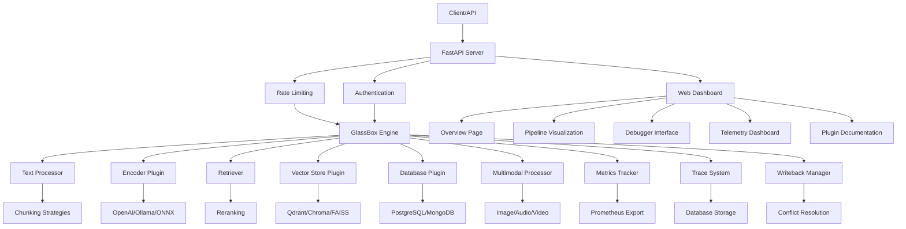

# GlassBox RAG

A production-ready, high-transparency modular RAG (Retrieval-Augmented Generation) framework designed for enterprise AI/ML applications. GlassBox provides comprehensive observability, extensibility, and performance monitoring capabilities.

## Features

### Core Capabilities
- **Modular Architecture**: Pluggable components for encoders, vector stores, databases, and multimodal processors
- **Multiple Vector Stores**: Support for Qdrant, Chroma, FAISS, Pinecone, Weaviate, and custom implementations
- **Embedding Providers**: OpenAI, Ollama, ONNX, Hugging Face, Cohere, Google, and custom embedders
- **Database Integration**: PostgreSQL, SQLite, MongoDB, MySQL, and Supabase compatibility
- **Multimodal Processing**: Support for text, images, audio, and video content
- **Advanced Chunking**: Recursive, sentence-based, and fixed-size chunking with overlap

### Production Features
- **Comprehensive Monitoring**: Real-time metrics, latency tracking, and cost analysis
- **Rate Limiting**: Built-in rate limiting middleware for API protection
- **Tracing & Debugging**: Detailed execution traces with visual debugging interface
- **Health Monitoring**: System health checks and component status tracking
- **Async/Await Support**: Full asyncio implementation for high performance
- **Type Safety**: Complete type hints with mypy validation

### Developer Experience
- **Web Dashboard**: Multi-page interface for monitoring, debugging, and pipeline visualization
- **Plugin System**: Extensible architecture with comprehensive documentation
- **Configuration Management**: Pydantic v2-based configuration with environment variable support
- **REST API**: FastAPI-based endpoints with automatic OpenAPI documentation
- **Testing Framework**: Comprehensive test suite with high coverage

## Installation

Install from PyPI:

```bash
pip install glassbox-rag
```

Or install from source:

```bash
git clone https://github.com/averoe/GlassBox.git
cd glassbox-rag
pip install -e .
```

## Quick Start

```python
from glassbox_rag import GlassBoxEngine, GlassBoxConfig, Document

# Initialize with configuration
config = GlassBoxConfig()
engine = GlassBoxEngine(config)

# Prepare documents
documents = [
    Document(content="Your document content here", metadata={"source": "example"}),
    Document(content="Another document", metadata={"source": "example2"})
]

# Ingest documents
await engine.ingest(documents)

# Retrieve relevant information
results = await engine.retrieve("your query", top_k=5)
for result in results:
    print(f"Content: {result.content}")
    print(f"Score: {result.score}")
    print(f"Metadata: {result.metadata}")
```

## Configuration

GlassBox uses YAML-based configuration with environment variable substitution:

```yaml
server:
  host: "0.0.0.0"
  port: 8000
  rate_limit: 100  # requests per minute

vector_store:
  type: "qdrant"
  config:
    url: "http://localhost:6333"
    collection_name: "glassbox_docs"

encoder:
  type: "openai"
  config:
    api_key: "${OPENAI_API_KEY}"
    model: "text-embedding-3-small"
    dimensions: 1536

database:
  type: "postgresql"
  config:
    url: "${DATABASE_URL}"
    connection_pool_size: 10

chunking:
  strategy: "recursive"
  chunk_size: 1000
  chunk_overlap: 200

multimodal:
  enabled: true
  processors:
    - type: "image"
      config:
        model: "clip-vit-base-patch32"

tracing:
  enabled: true
  storage: "database"
  retention_days: 30
```

## API Endpoints

### Core Operations
- `GET /health` - System health check with component status
- `POST /retrieve` - Retrieve relevant documents for a query
- `POST /ingest` - Ingest new documents into the system
- `POST /update` - Update existing documents with writeback protection
- `DELETE /documents/{doc_id}` - Remove documents from the system

### Monitoring & Debugging
- `GET /metrics/prometheus` - Prometheus-compatible metrics export
- `GET /traces` - List execution traces with filtering
- `GET /traces/{trace_id}` - Get detailed trace information
- `GET /traces/{trace_id}/export` - Export trace data as JSON

### Dashboard
- `GET /` - Web dashboard interface
- `GET /api/dashboard/overview` - Dashboard overview data
- `GET /api/dashboard/telemetry` - Telemetry and performance data

## Running the Server

Start the FastAPI server:

```bash
# Using the module
python -m glassbox_rag

# Or with uvicorn directly
uvicorn glassbox_rag.server:app --host 0.0.0.0 --port 8000
```

The server will be available at `http://localhost:8000` with automatic API documentation at `http://localhost:8000/docs`.

## Web Dashboard

Access the comprehensive web dashboard at `http://localhost:8000` featuring:

### Overview Page
- Real-time system metrics and health status
- Component status monitoring
- Recent activity feed
- Key performance indicators

### Pipeline Visualization
- Interactive SVG pipeline diagram
- Step-by-step execution flow
- Real-time execution testing
- Performance metrics per pipeline stage

### Debugger Interface
- Execution trace listing with filtering
- Detailed trace visualization
- Step-by-step timing breakdown
- Trace export functionality

### Telemetry Dashboard
- Performance charts (latency, throughput)
- Cost breakdown by service
- Token usage analytics
- Performance percentile tracking

### Plugin Development
- Interactive documentation for all plugin types
- Code examples and configuration guides
- Extensibility patterns and best practices

## Plugin Architecture

GlassBox supports four main plugin types:

### 1. Encoder Plugins
Create custom embedding providers:

```python
from glassbox_rag.plugins.base import BaseEncoder
import numpy as np

class CustomEncoder(BaseEncoder):
    async def encode(self, texts: List[str]) -> np.ndarray:
        # Your embedding implementation
        embeddings = await self.compute_embeddings(texts)
        return np.array(embeddings)

    async def encode_query(self, query: str) -> np.ndarray:
        return await self.encode([query])
```

### 2. Vector Store Plugins
Implement custom vector storage backends:

```python
from glassbox_rag.plugins.base import VectorStorePlugin

class CustomVectorStore(VectorStorePlugin):
    async def add_vectors(self, vectors: np.ndarray, metadata: List[dict]) -> List[str]:
        # Store vectors and return IDs
        ids = await self.store_vectors(vectors, metadata)
        return ids

    async def search(self, query_vector: np.ndarray, top_k: int) -> List[RetrievalResult]:
        # Search and return results
        results = await self.perform_search(query_vector, top_k)
        return results
```

### 3. Database Plugins
Create custom document storage backends:

```python
from glassbox_rag.plugins.base import DatabasePlugin

class CustomDatabase(DatabasePlugin):
    async def store_document(self, doc_id: str, content: str, metadata: dict):
        # Store document
        await self.insert_document(doc_id, content, metadata)

    async def get_document(self, doc_id: str) -> Optional[dict]:
        # Retrieve document
        return await self.fetch_document(doc_id)
```

### 4. Multimodal Plugins
Process different content types:

```python
from glassbox_rag.plugins.base import BaseMultimodalProcessor

class ImageProcessor(BaseMultimodalProcessor):
    async def process(self, content: MultimodalContent) -> List[str]:
        # Extract text from images
        texts = await self.extract_text_from_image(content.content)
        return texts
```

## Testing

Run the comprehensive test suite:

```bash
# Run all tests
pytest tests/ -v

# Run with coverage
pytest tests/ --cov=glassbox_rag --cov-report=html

# Run specific test categories
pytest tests/unit/ -v      # Unit tests
pytest tests/integration/ -v  # Integration tests
```

## Architecture

### System Overview



### Core Components

- **Engine**: Orchestrates all RAG operations and coordinates components
- **Encoder**: Handles text and multimodal content encoding to vectors
- **Retriever**: Implements retrieval strategies and reranking
- **Database**: Manages document storage and metadata
- **Vector Store**: Handles vector storage and similarity search
- **Metrics Tracker**: Monitors performance, costs, and usage
- **Trace System**: Records execution traces for debugging and analysis
- **Writeback Manager**: Handles document updates with conflict resolution
- **Text Processor**: Implements advanced chunking and preprocessing

### Data Flow

```
Input Query/Document
        ↓
   Text Processing
        ↓
     Chunking
        ↓
    Encoding
        ↓
  Vector Store
        ↓
   Retrieval
        ↓
  Reranking
        ↓
   Response
```

## Production Deployment

### Docker Deployment
```bash
# Build the image
docker build -t glassbox-rag .

# Run with configuration
docker run -p 8000:8000 \
  -v $(pwd)/config:/app/config \
  -e OPENAI_API_KEY=your_key \
  glassbox-rag
```

### Docker Compose
```yaml
version: '3.8'
services:
  glassbox:
    image: glassbox-rag
    ports:
      - "8000:8000"
    volumes:
      - ./config:/app/config
    environment:
      - OPENAI_API_KEY=${OPENAI_API_KEY}
      - DATABASE_URL=${DATABASE_URL}
    depends_on:
      - qdrant
      - postgres

  qdrant:
    image: qdrant/qdrant
    ports:
      - "6333:6333"

  postgres:
    image: postgres:15
    environment:
      - POSTGRES_DB=glassbox
      - POSTGRES_USER=glassbox
      - POSTGRES_PASSWORD=password
```

## Monitoring & Observability

GlassBox provides comprehensive monitoring capabilities:

- **Prometheus Metrics**: Export metrics in Prometheus format
- **Health Checks**: Component-level health monitoring
- **Tracing**: Detailed execution traces with timing
- **Cost Tracking**: Token usage and API cost monitoring
- **Performance Metrics**: Latency percentiles and throughput

## Contributing

We welcome contributions! Please:

1. Fork the repository
2. Create a feature branch
3. Add tests for new functionality
4. Ensure all tests pass
5. Submit a pull request

**Note**: Detailed contributing guidelines (CONTRIBUTING.md) are not yet available. Please follow standard Python development practices and ensure your code includes proper type hints and documentation.

## Documentation

**Note**: Comprehensive documentation is not yet available. The project includes:
- This README with setup and usage instructions
- Inline code documentation and type hints
- Web dashboard with interactive plugin documentation
- API documentation available at `/docs` when running the server

We plan to add full documentation in future releases.

## License

Licensed under the Apache License 2.0. See LICENSE file for details.

## Support

For issues, questions, or suggestions:
- Open an issue on GitHub
- Check the web dashboard documentation at `http://localhost:8000` when running the server
- API documentation available at `http://localhost:8000/docs` when running the server
- Join our community discussions